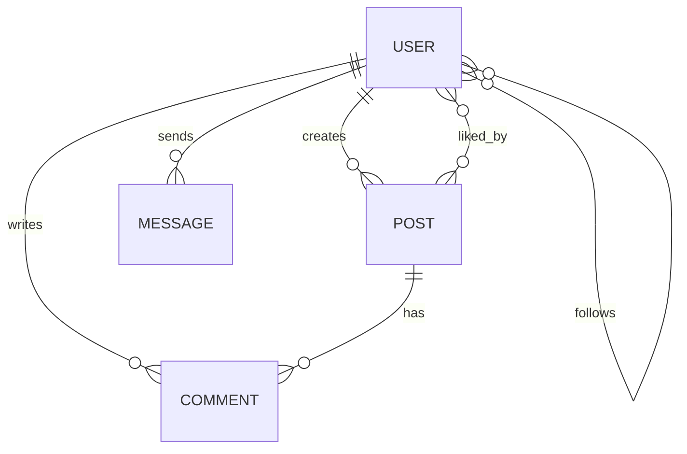

# IG Clone — Production-style Full-Stack Social Platform (MVP-scale) 

**English** | [繁體中文](./README.md)

A production-style social platform implementation built with Node.js, MongoDB, Socket.io, Docker, and AWS.

This project is based on the core interaction flows of Instagram, covering:

- User authentication (JWT)
- Post creation and interaction (Like / Comment)
- Follow relationship management
- Real-time chat (WebSocket)
- Image upload and compression flow
- Containerized deployment via Docker
- Automated testing and deployment via GitHub Actions (CI/CD)

The project primarily showcases the integration of backend engineering, system design, DevOps, and deployment workflow capabilities.


[](https://github.com/TZUHAN07/ig-clone/actions/workflows/test.yml)
[](https://github.com/TZUHAN07/ig-clone/actions/workflows/deploy.yml)

🌐 **Live Demo**: https://ig-clone.tzuhan.dev
(AWS EC2 + Docker + Nginx + Cloudflare)

### Quick Try (No Registration)

Click **Try Demo** on the login page to instantly log in with a pre-configured test account, with posts and chat data already set up.

#### Test Real-time Chat (Multi-device Sync)

To verify Socket.io real-time sync, open two browser windows simultaneously:

- **Window 1**: Click **Try Demo** → auto-login as `demo`
- **Window 2** (Incognito recommended):
  - Email: `demo2@tzuhan.dev`
  - Password: `Demo2234`

Send messages between them to test:

- Real-time sync
- Room-based event handling
- JWT handshake authentication
- Multi-device sync

---

# Project Scope

A portfolio project demonstrating production-style full-stack implementation.
At MVP scale, this project showcases:

- API design capabilities
- Data modeling capabilities
- Real-time system integration capabilities
- Testing and deployment capabilities
- Maintainable engineering thinking

---

# System Constraints

- Design target: MVP / Early-stage product
- Deployment: Single-region
- Hosting: AWS EC2 t2.micro
- Expected usage: small-scale MVP / early-stage product
- Eventual consistency accepted (followers / likes)

Currently out of scope:

- Multi-region replication
- Auto-scaling
- Disaster recovery

---

# Demo & Core Features

## Real-time Chat System

https://github.com/user-attachments/assets/86390812-6034-4f65-b9e1-4f8ab6fc3d43

* Built real-time chat with Socket.io, supporting room-based event handling and acknowledgement callbacks.
* Multi-device synchronization on the same account.

## Image Upload & Post Flow

https://github.com/user-attachments/assets/a38f6e2f-2934-4af4-be25-1be57be56a77

* Image upload via AWS S3 with Multer + Sharp for compression and resizing.
* Home feed dynamic update using CustomEvent pattern (no page reload).
* Supports Instagram-style carousel posts (1–10 images).

---

# Technical Highlights

* JWT authentication with Socket.io handshake middleware for real-time connection authorization.
* Docker Compose + `docker-compose.override.yml` separating development and production environments.
* Docker Buildx for cross-platform deployment (Apple Silicon ARM64 + AWS EC2 AMD64).
* `IntersectionObserver` + pagination for infinite scroll.

---

# Tech Stack

## Backend

* Node.js
* Express.js
* MongoDB (Mongoose)
* Socket.io
* JWT Authentication
* Multer
* Sharp

## Frontend

* Vanilla JavaScript (ES6+)
* HTML5
* CSS3
* Responsive Web Design

## Testing

* Jest
* Supertest
* mongodb-memory-server

## DevOps & Cloud

* Docker
* Docker Compose
* Docker Buildx
* GitHub Actions CI/CD
* Nginx
* AWS EC2 / S3
* Cloudflare

---

# CI/CD Workflow

Deployment automatically triggers on merge to `main` branch:

`Push → Test → Build Docker Images → Deploy to EC2`

* GitHub Actions runs Jest and Supertest tests automatically.
* Docker images built and pushed to Docker Hub.
* Deployment to AWS EC2 via SSH workflow.
* Sensitive credentials and SSH keys managed via GitHub Secrets.

---

# Testing

```bash
cd backend

npm test
npm run test:coverage
```

Current test coverage:

* Custom error handling unit tests
* Authentication API integration tests
* Isolated in-memory MongoDB test environment via `mongodb-memory-server`

---

# Database Design



## Schema Design Considerations

* Embedded sub-documents for media info, reducing post query cost.
* Compound index for optimizing feed query performance.
* Designed follower / like relationships with future collection-split scalability in mind.
* Documented migration path for large-scale follower relationships.

> Full ERD, schema design rationale, and scale considerations: see [docs/architecture.md](docs/architecture.md).

---

# Engineering Notes

Additional deployment and architecture notes are organized under `/docs`:

* Docker deployment
* Cloudflare and WebSocket proxy issues
* MongoDB schema scaling
* GitHub Actions CI/CD setup

---

# Known Limitations

Some features are still in MVP-stage implementation:

* Backend supports 1–10 image carousel media schema, but frontend UI currently renders single-image only
* Feed pagination currently uses skip/limit, not yet migrated to cursor-based pagination
* WebSocket is currently a single-instance deployment and does not yet support horizontal scaling.

These items are planned for ongoing refactoring in future versions.

---

# Roadmap

## In Progress

* Read receipt / typing indicator
* Integration test coverage expansion
* Cursor-based pagination
* Followers / Following modal with search

## Planned

* Redis caching
* Structured logging
* TypeScript migration
* Stories / Reels features

---

# Author

**Tzu Han Chao (Joanne)**

* GitHub: https://github.com/TZUHAN07
* Email: [joannechao1007@gmail.com](mailto:joannechao1007@gmail.com)
