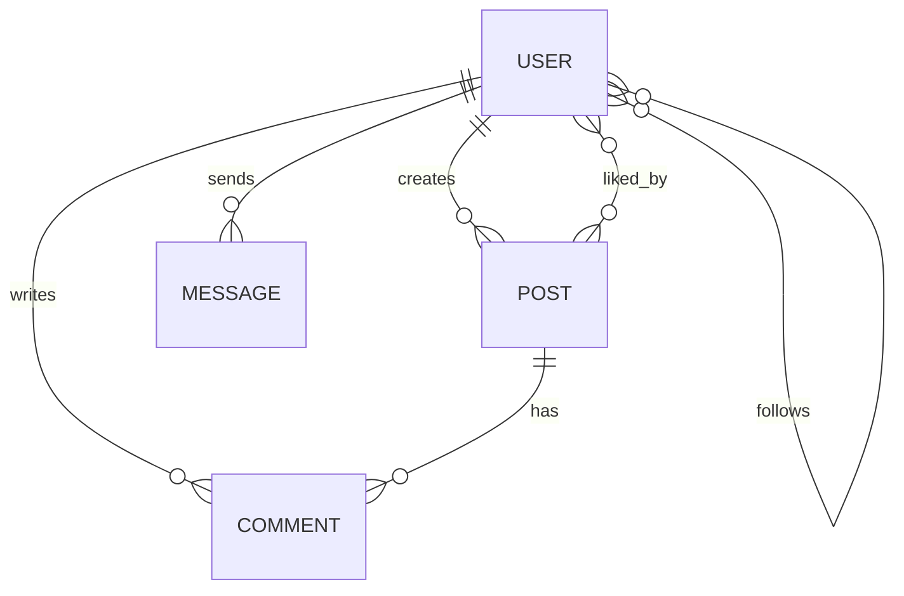

# IG Clone

使用 Node.js、MongoDB、Socket.io、Docker 與 AWS 打造的 production-ready Instagram 全端仿作。

專案涵蓋即時聊天、JWT 驗證、AWS S3 圖片上傳、Docker multi-platform deployment，以及 GitHub Actions CI/CD 自動部署流程。

[](https://github.com/TZUHAN07/ig-clone/actions/workflows/test.yml)
[](https://github.com/TZUHAN07/ig-clone/actions/workflows/deploy.yml)

🌐 **Live Demo**：https://ig-clone.tzuhan.dev
（AWS EC2 + Docker + Nginx + Cloudflare）

---

# Demo 與核心功能

## 即時聊天系統

https://github.com/user-attachments/assets/86390812-6034-4f65-b9e1-4f8ab6fc3d43

* 使用 Socket.io 建立即時聊天功能，支援 room-based event handling 與 acknowledgement callback。
* 支援同帳號多裝置同步更新。
* 透過 Nginx WebSocket reverse proxy 解決 Cloudflare Free Plan 無法代理非標準 port 的限制。

## 圖片上傳與發文流程

https://github.com/user-attachments/assets/a38f6e2f-2934-4af4-be25-1be57be56a77

* 使用 AWS S3 建立圖片上傳流程，搭配 Multer 與 Sharp 進行圖片壓縮與 resize。
* 使用 CustomEvent pattern 實作首頁動態更新，不需重新整理頁面。
* 支援 Instagram carousel 形式的多圖貼文（1–10 張）。

---

# 技術亮點

* JWT authentication 搭配 Socket.io handshake middleware，實作即時連線驗證。
* 使用 Docker Compose 與 `docker-compose.override.yml` 分離開發與 production 環境。
* 使用 Docker Buildx 支援 Apple Silicon（ARM64）與 AWS EC2（AMD64）跨平台部署。
* 使用 `IntersectionObserver` 與 pagination 實作 infinite scroll。
* 設定 Express `trust proxy` 與 Nginx `X-Forwarded-For`，正確取得 client IP 並支援 rate limiting。
* 處理 iOS Safari `100dvh` viewport 問題，優化 mobile 使用體驗。

---

# Tech Stack

## Backend

* Node.js
* Express.js
* MongoDB（Mongoose）
* Socket.io
* JWT Authentication
* Multer
* Sharp

## Frontend

* Vanilla JavaScript（ES6+）
* HTML5
* CSS3
* RWD 響應式設計

## Testing

* Jest
* Supertest
* mongodb-memory-server

## DevOps & Cloud

* Docker
* Docker Compose
* Docker Buildx
* GitHub Actions CI/CD
* Nginx
* AWS EC2 / S3
* Cloudflare

---

# CI/CD Workflow

部署流程會在 merge 到 `main` branch 後自動觸發：

`Push → Test → Build Docker Images → Deploy to EC2`

* GitHub Actions 自動執行 Jest 與 Supertest 測試。
* 自動 build Docker image 並 push 至 Docker Hub。
* 透過 SSH workflow 自動部署至 AWS EC2。
* 使用 GitHub Secrets 管理敏感憑證與 SSH key。

---

# Testing

```bash id="q0d2wo"
cd backend

npm test
npm run test:coverage
```

目前測試涵蓋：

* 自訂 error handling unit test
* authentication API integration test
* 使用 `mongodb-memory-server` 建立隔離的 in-memory MongoDB 測試環境

---

# Database Design



## Schema Design Considerations

* 使用 embedded sub-document 儲存 media 資訊，降低 post query 成本。
* 建立 compound index 優化 feed query 效能。
* 保留 follower / like relationship 後續拆分 collection 的 scalability 遷移空間。
* 文件化大型 follower relationship 的 migration path。

---

# Engineering Notes

額外的 deployment 與 architecture 筆記整理於 `/docs`：

* Docker deployment
* Cloudflare 與 WebSocket proxy 問題
* MongoDB schema scaling
* GitHub Actions CI/CD 設定

---

# Roadmap

## In Progress

* apiFetch wrapper refactor
* Read receipt / typing indicator
* Integration test coverage 擴充
* Cursor-based pagination

## Planned

* Redis caching
* Structured logging
* TypeScript migration
* Stories / Reels 功能

---

# Author

**趙紫涵（Tzu Han Chao / Joanne）**

* GitHub：https://github.com/TZUHAN07
* Email：[joannechao1007@gmail.com](mailto:joannechao1007@gmail.com)
