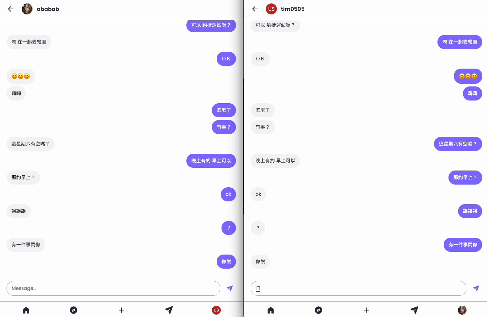
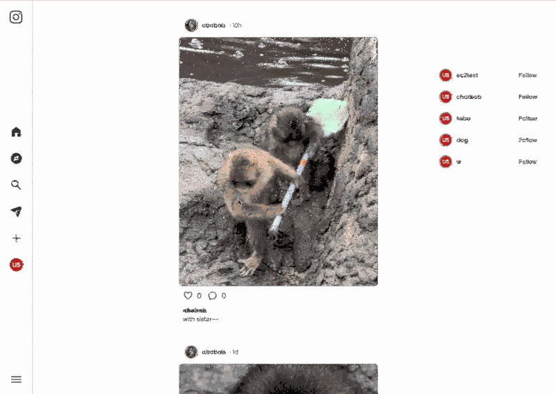
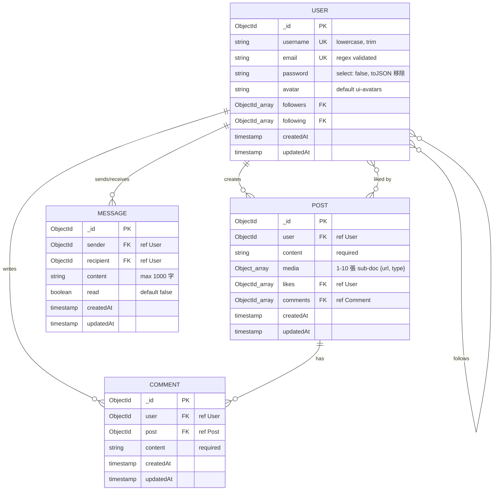

# IG Clone

> 全端 IG 仿作 — Socket.io 即時聊天 + S3 多圖上傳 + Docker 部署

🌐 **Live Demo**：[https://44.211.175.201/](https://44.211.175.201/)（AWS EC2 + Docker + nginx）

## Demo

### 即時聊天 + Mobile RWD（一個 GIF 三個亮點）



> Mobile viewport 雙視窗 demo，涵蓋 3 個技術點：
> - **Socket.io 即時推送** — 一邊送 → 另一邊立刻收到，不用 refresh
> - **多裝置同步** — 同一帳號多裝置即時更新
> - **Mobile RWD 切 view 模式** — list ↔ message-area 切換，用 state class pattern + CSS `:has()` 實作

### 發文流程



> 從點 + 開 modal → 選圖 → 寫 caption → Share → 首頁即時刷新：
> - **AWS S3 圖片上傳** + Sharp 自動 resize
> - **Mongoose 寫入 Post + populate user**
> - **CustomEvent dispatch `postCreated` → 首頁 listener 即時刷新**（不用 refresh page）

## Features

- **多圖貼文上傳** — schema 支援 1-10 張（前端 UI 多圖選擇 in progress）
- **即時聊天室** — Socket.io + ack callback + 多裝置同步
- **即時搜尋** — debounce + Mongoose regex
- **追蹤 / 按讚 / 留言**
- **JWT auth** + io.use socket 握手驗證
- **響應式 RWD** — mobile chat 切 view 模式（state class + CSS :has()）
- **AWS S3 圖片儲存** + Sharp 自動 resize

## Tech Stack

**Backend**
- Node.js / Express
- MongoDB / Mongoose
- Socket.io（即時通訊）
- JWT（auth）
- Multer + Sharp（圖片處理）
- AWS S3（圖片儲存）

**Frontend**
- 純 JavaScript（無 framework）
- HTML5 / CSS3 / CSS variable design system
- 響應式 RWD（含 mobile 切 view）

**DevOps**
- Docker / Docker Compose
- nginx（靜態檔伺服）
- nodemon（dev hot reload）

## Database Schema



### Schema 設計亮點

- **User 密碼雙層保護**：`select: false` + `toJSON transform` 雙保險（單一防線會在 `findOne().select('+password')` 時失守）
- **Follower / Following 對稱欄位**：用 `ObjectId` array 雙向儲存，方便 `$lookup` 跨集合 join
- **Post.media sub-schema**：embed 而非另開 collection，因為 media 不會被獨立查詢（一定跟 post 一起）
- **Message 雙端 ref**：sender + recipient 都 ref User，方便 aggregation 用 `$cond` 取「對話的另一個人」
- **Post indexes**：`{user: 1, createdAt: -1}` 跟 `{createdAt: -1}` 加速個人 feed 跟首頁 feed 查詢

## Quick Start

需求：Docker Desktop + Docker Compose

```bash
# 1. clone repo
git clone https://github.com/TZUHAN07/ig-clone.git
cd ig-clone

# 2. 設定環境變數
cp backend/.env.example backend/.env
# 編輯 backend/.env，填入：
#   MONGO_URI=mongodb://...
#   JWT_SECRET=your-secret
#   AWS_ACCESS_KEY_ID=...
#   AWS_SECRET_ACCESS_KEY=...
#   AWS_BUCKET_NAME=...

# 3. 啟動所有服務（backend + frontend + mongo）
docker compose up --build -d

# 4. 開瀏覽器
open http://localhost
```

服務 port：
- Frontend: `localhost:80`（nginx serve）
- Backend: `localhost:3000`
- MongoDB: container 內部，host 不對外開

## Roadmap

### 短期（in progress）
- [ ] Frontend 多圖選擇 UI + carousel 預覽（backend schema 已準備）
- [ ] Read receipt / typing indicator（chat 階段 3）
- [ ] Domain + SSL（Let's Encrypt）

### 中期
- [ ] Cursor-based pagination（取代 skip/limit，避免大資料量效能下降）
- [ ] TypeScript migration（API contract、避免再踩 schema mismatch）
- [ ] CI/CD pipeline（GitHub Actions 自動測試 + 部署）
- [ ] Unit test 補完（Jest，目前 frontend 純函式有手動驗證）
- [ ] Search 加 hashtag

### 長期
- [ ] Stories（IG 限時動態）
- [ ] Reels（短影音）

## Author

**Tzu Han Chao**

- Email: joannechao1007@gmail.com
- GitHub: [@TZUHAN07](https://github.com/TZUHAN07)
