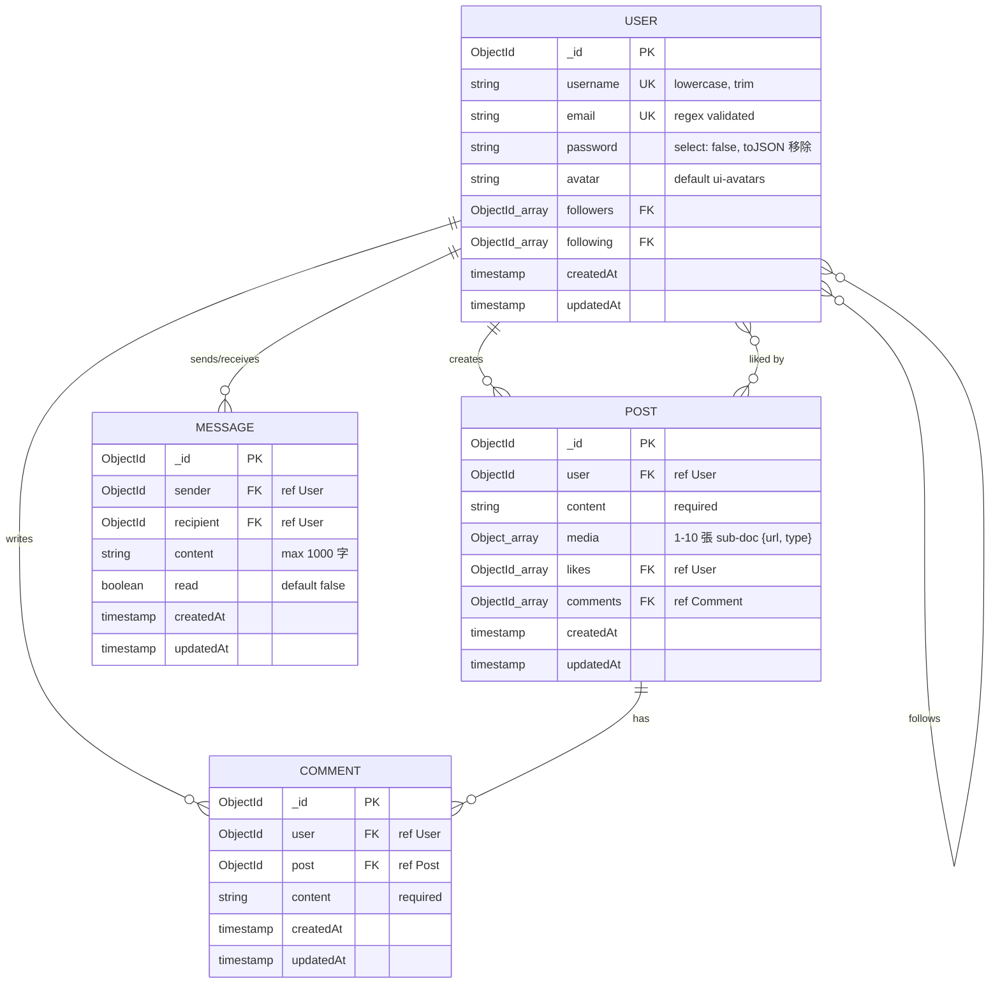

# Architecture & Database Design

本文件記錄 ig-clone 後端的整體架構、Schema 設計理由，以及 MVP 階段的設計取捨。

---

# System Architecture

```text
Frontend (Vanilla JS)
        ↓
Backend API (Node.js + Express)
        ↓
MongoDB Atlas
        ↓
AWS S3 (image storage)

Realtime Communication:
Socket.io + WebSocket
```

---

# Database Schema



---

# Schema Design Decisions

## Comment 使用獨立 collection

Comment 需要：

* 分頁
* 時間排序
* 單則刪除

若 embed 進 Post，熱門貼文可能造成 document 過大，因此採用獨立 collection。

---

## Media 使用 embedded sub-document

Media 只會跟隨 Post 一起查詢，不需要獨立搜尋。

因此使用 embedded sub-document：

* 減少 query complexity
* 降低 join 成本
* 簡化資料模型

---

## Message 使用 sender / recipient 雙 ref

MVP 階段不需要 group chat。

因此 Message 直接使用：

* sender
* recipient

即可完成雙人聊天室查詢。

---

# Query & Index Strategy

## Feed Query

```js
Post.find({ user })
  .sort({ createdAt: -1 });
```

使用 compound index：

```js
postSchema.index({ user: 1, createdAt: -1 });
```

降低 feed query 的排序成本。

---

## Comment Query

```js
Comment.find({ post })
  .sort({ createdAt: -1 });
```

---

# Future Scaling Considerations

目前 MVP 使用 array-based relationship：

```js
followers: [ObjectId]
likes: [ObjectId]
```

此設計能降低開發複雜度並簡化 query。

未來若 follower / like 關係大幅成長，
可拆分為獨立 collection 以避免 document growth 與 write contention。

---

# Engineering Trade-offs

| Decision | Current Choice           | Trade-off             |
| -------- | ------------------------ | --------------------- |
| Comments | Separate collection      | 多一次 query，但更易擴展       |
| Media    | Embedded sub-document    | query 較簡單，但 schema 耦合 |
| Follows  | Array-based relationship | MVP 簡單，但大型社交圖會受限      |
| Messages | No conversation table    | 結構簡單，但未支援群組聊天室        |

---

# Testing Strategy

目前測試包含：

* authentication integration test
* custom error handling unit test
* isolated MongoDB testing（mongodb-memory-server）

---

# Future Improvements

* Cursor-based pagination
* Redis caching
* Read receipt / typing indicator
* Structured logging
